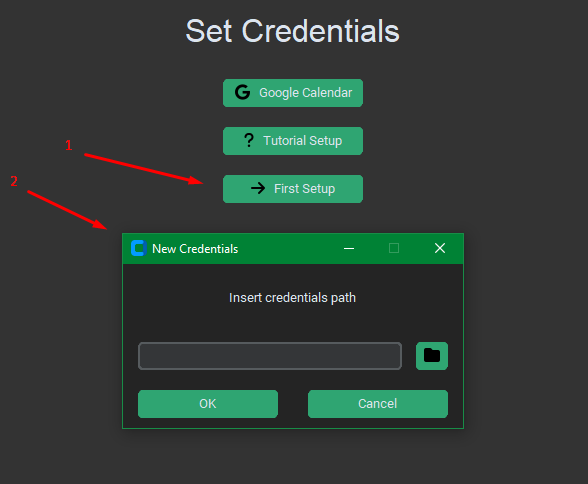

# Google Calendar Data Manager

## 📜 Description
This program, with a simple graphical interface, allows you to manage Google calendar events in a powerful way, specifically you can:
- **create events**;
- **edit multiple events** at once by filtering by multiple fields;
- **get a list of events** by filtering by multiple fields and save the results in a .csv/.tx file;
- **generate graphs** using the .csv/.tx file generated after getting the list of events, so you can get statistics for what you want.

## ☕ Donate for this Project

This project is entirely free, devoid of any paid content or advertisements. It has been developed without any associated costs. If you appreciate this project and would like to contribute to its sustainability, you have the option to make a donation. Your support is genuinely appreciated. Thank you wholeheartedly! 💙

## 👀 Overview

## ✨ Installation
1. ### Download the installer and install the application
    Once the installation is complete, you can run the application, but you must complete the first setup procedure by entering the data to connect the application to Google Calendar with your personal account.
    
    To enter the credentials path, you need to follow the guide below.
2. ### Obtain credentials.json From Google Cloud
    * [FULL GUIDE](./docs/GoogleCloudAPISetup.md)

### Google API
* [Info](https://developers.google.com/calendar/api/quickstart/python?hl=en)
* [Errors](https://developers.google.com/calendar/api/guides/errors?hl=en)

## 🐛 Report a BUG
To report a BUG -> [ISSUE](https://github.com/DennisTurco/Google-Calendar-Data-Manager/issues)

## Licence

## Authors

- [@DennisTurco](https://www.github.com/DennisTurco)

## Support

For support, email: dennisturco@gmail.com