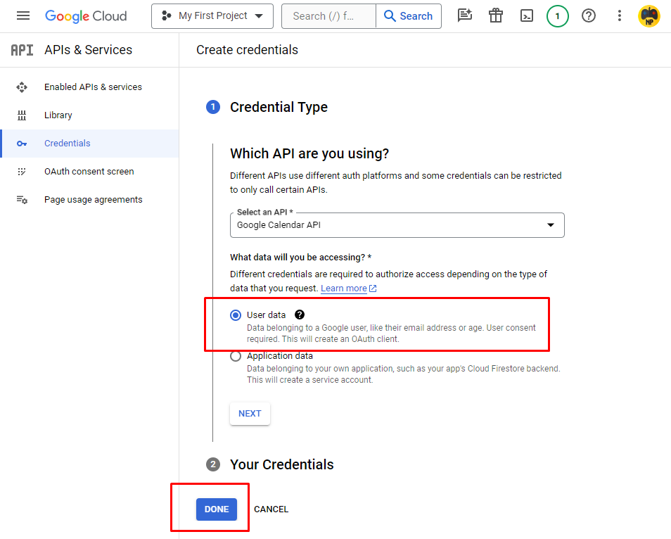

## Get Google Calendar API credentials.

To communicate with Google Calendar you need to create a FREE project in Google Cloud.
Don't worry, it is not a long process and I will guide you step by step through this simple procedure.

1. [Create a Google Cloud project for Google Workspace app, extension or integration](https://console.cloud.google.com/projectcreate)

2. Enable the APIs you want to use in your Google Cloud project.
    1. Access the hamburger menu;
    2. *APIs & Services*;
    3. *Enables APIs & services*;
        
    4. *ENABLE APIS AND SERVICES*;
        
    5. Search for *Google Calendar API*;
    6. Enable *Google Calendar API*.
        
    7. *CREATE CREDENTIALS*;
        
        1. Credential type.
            * Select *User data*;
            * Press *next*.
        2. OAuth Consent Screen.
            * Now you can fill in only the necessary credentials with your personal information.
            * Go to *SAVE AND CONTINUE*.
        3. Scopes (Optional)
            * The "Scopes" section is completely optional, so you can ignore it and go to the next section.
        4. OAuth Client ID.
            * Set the application type to *Desktop application*;
            * Go to *CREATE*.
        5. Credentials.
            * Now you can download the credentials.json file.
            * Press *DONE*.

3. Create login credentials to authenticate end users or service accounts in your app.

    * You must now enable your account. To do this, go to the *OAuth consent screen* screen, then to the "Test Users" section, press the *ADD USERS* button and add your account.
    

4. Download the credentials .json file and rename it to "credentials.json". Place it in the settings folder located at the root of the project (create the folder if it does not already exist).